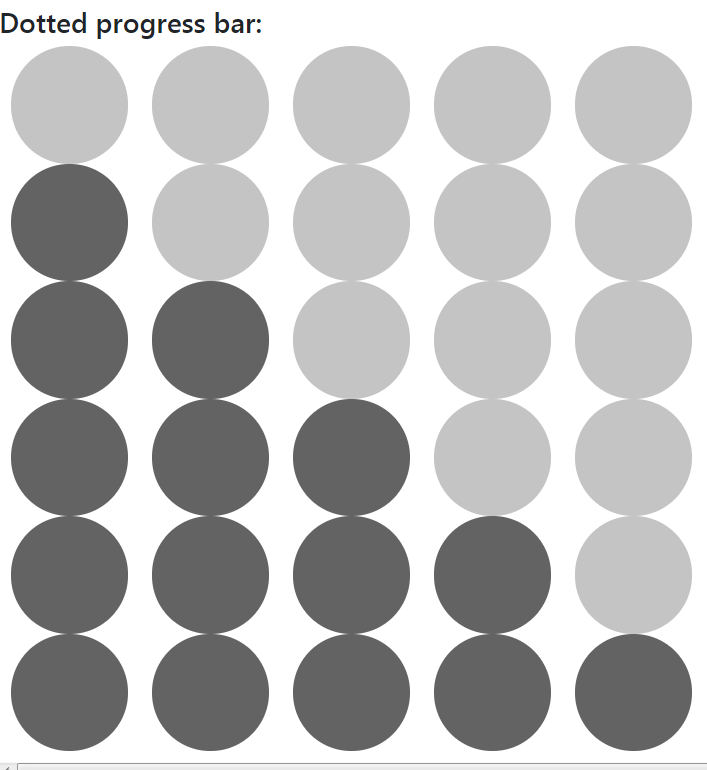

# myCSS
My css and Js with ideas, to make your website better  

## -Dotted progress bar  
usage:  
> \
\</div\>  
> \
1\</div\>  
> \
2\</div\>  
> \
3\</div\>  
> \
4\</div\>  
> \
5\</div\>  
result:  
  
Update v1.0:  
progress has been moved to div.  
progress can be decimal.  
> \
3.4\</div\>  
Update v1.1:  
scope added.  
> \
3.7/4.3\</div\>  
Update v1.2:  
percentage value  
> > \
37.5%\</div\>  
# Ideas:  
